# display-boxes

## Description

Bash function to display nice-looking boxes around your content like:

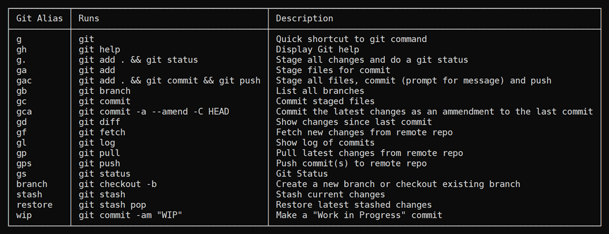

The function will automatically determine the length of each column and draw the box appropriately. It accepts two multi-line strings which have tab-separated columns.

### $headers

The first contains the header data with tabs separating out the columns.

### $body

The second contains the body data which is typically a multi-line string with tabs separating the columns.

### $style

The third argument is optional and can be used to set the [box style](#box-styles)

### $padding

The fourth argument is optional and can be passed in to alter the padding left and right of the data. Default is 1.

## Usage

### Quick example

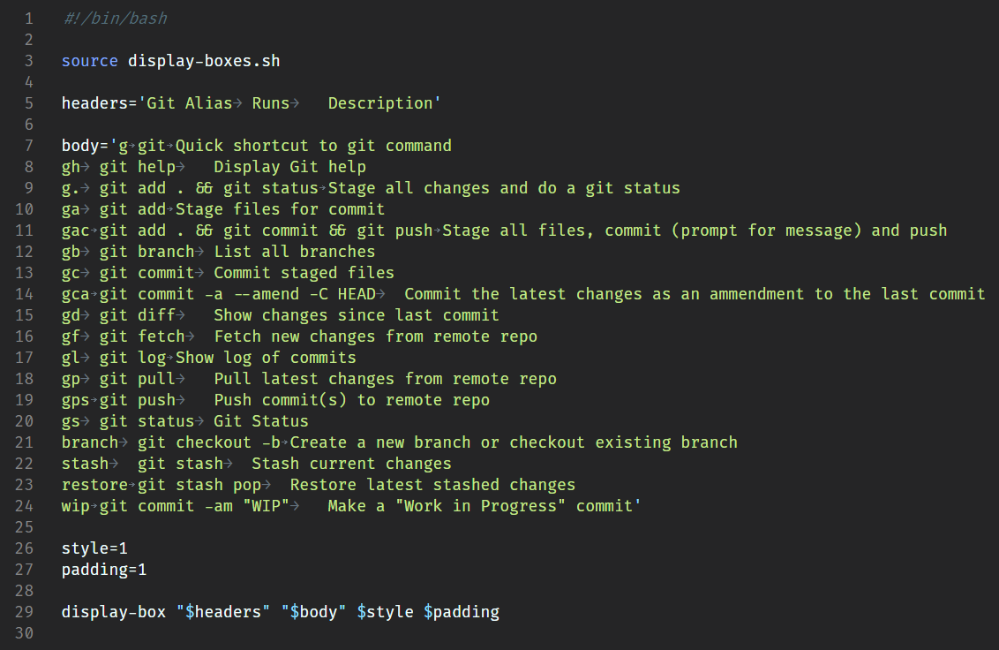

Deeper dive walk-through of each section:

### Step 1)

Include the function

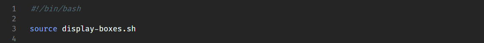

### Step 2)

Create two strings that are tab-separated

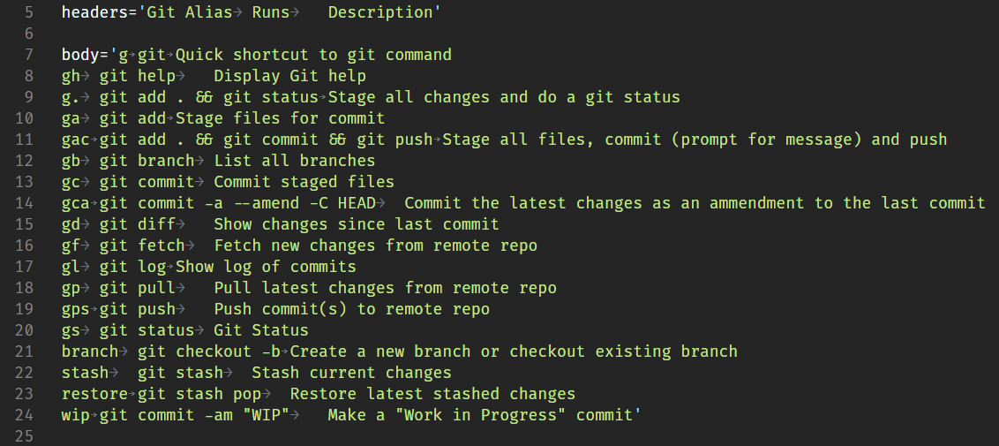

### Step 3)

Optionally define the [box style](#box-styles) and the padding

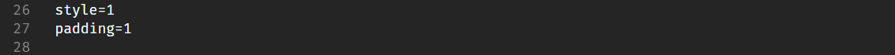

### Step 4)

Call the display-box function passing in the required $headers and $body variables. Other optional variables are Box Style and Padding

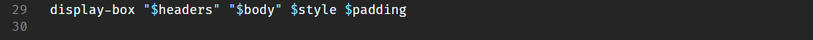

## Box Styles

There are several different box styles you can choose between

### Type 1 - Single-bars

### Type 2 - Double-bars

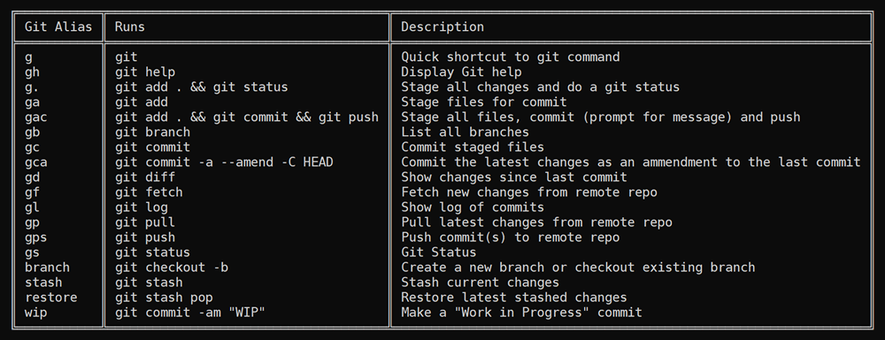

### Type 3 - Double-outer, single-inner

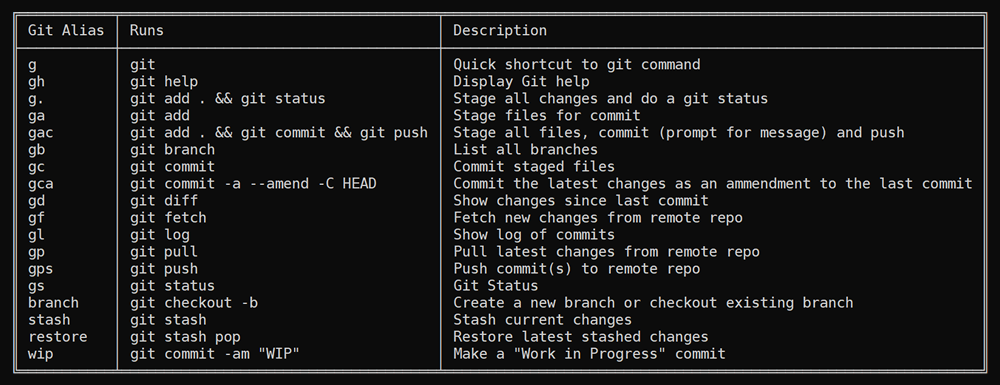

### Type 4 - Double-bars without side walls

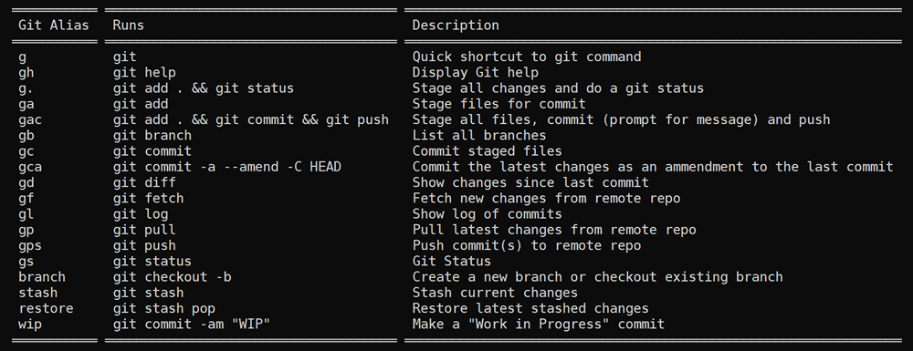

### Type 5 - Double Bars on top and bottom without side walls

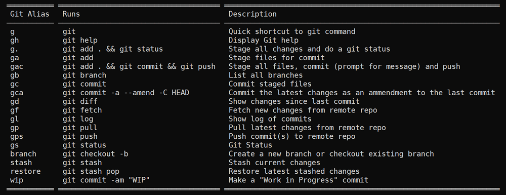

### Type 6 - Minimal

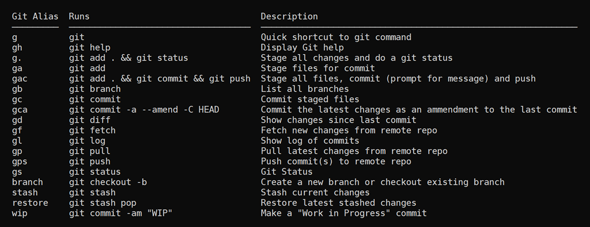

## Examples

There are two example scripts included in the `examples` directory. The `examples/example-all.sh` script will display the example in all available styles.

## Future enhancements under consideration

1. Custom column delimiter
2. Add Colors (borders, background, separate for header/body)
3. Option to add drop-shadow
4. Separate padding-left from padding-right
5. Possibly add different padding for header vs body
6. Option to add bars between each line in body (like Excel)
7. Add style for solid block bars (https://en.wikipedia.org/wiki/Block_Elements)
8. Add style with double-bars for header and single bars for body
9. Add style with double-bars for header and outside but single bars for body columns
10. Add style with only horizontal bars
11. Pass in a single multi-line string and assume the top line is the header (option to ignore it)
12. Option to add margin between columns (as opposed to padding) for styles without vertical bars

## Versions

| Version Number | Date Released | Description of changes |
| -------------- | ------------- | ---------------------- |
| v1.0           | 30 Apr 2020   | Initial version        |

